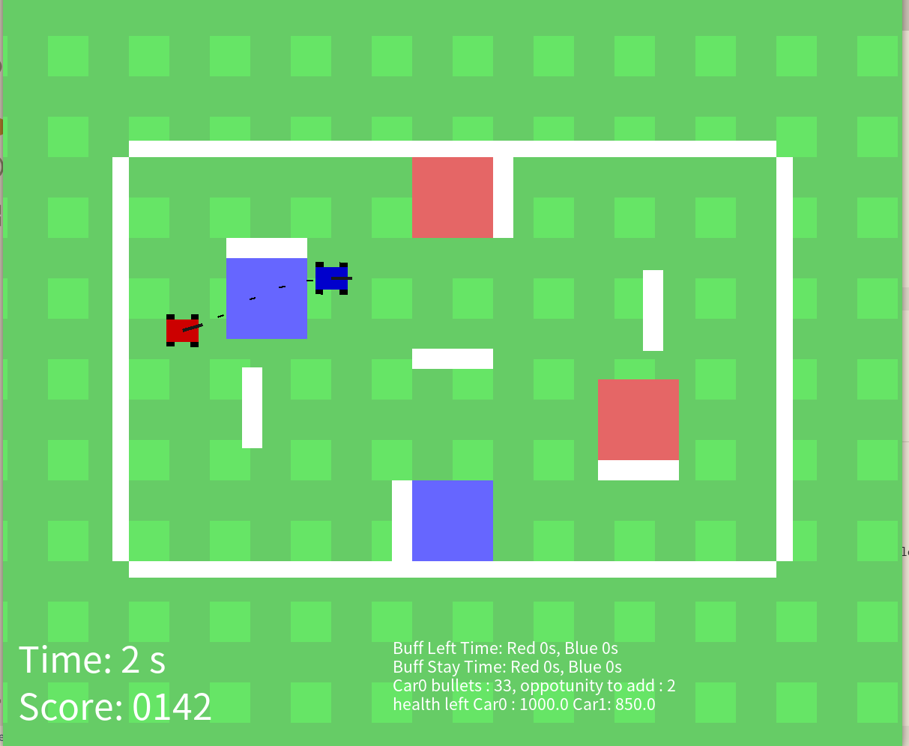

# ICRA 2019 Simulator

## Requirements

- Python3
- Pytorch
- OpenAI gym
- Box2D
- swig

## Environment

### Anaconda (Recommonded)

```
conda create -f environment.yaml
conda activate ICRA
```

### Pip

```
sudo apt-get install swig # or install from source
pip3 install gym box2d box2d-kengz
pip3 install pytorch
```

## Try the simulator

```
python3 ICRABattleField.py
```

You can use WASD to move the red robot, QE to rotate it, SPACE to shoot projectiles (the gun will aim the enemy automatically) and R to supply projectiles (in the red supply area, top middle).


## Train

```
python train.py --seed 233 --enemy hand --save_model_path "ICRA_save.model" --epoch 1000 --update_step 10
```

Use the hand-written agent as the enemy. Save the trained model to ICRA_save.model. Train 1000 epoches and update the model every 10 epoch.

## Test

```
python test.py --seed 233 --enemy hand --load_model --load_model_path "ICRA_save.model" --epoch 50
```

Use the hand-written agent as the enemy. Use the trained model in ICRA.model. Test 50 epoches.

## Screenshot


## Video on real robot
<iframe width="560" height="315" src="https://www.youtube.com/embed/pTiAzl6hWXM" frameborder="0" allow="accelerometer; autoplay; encrypted-media; gyroscope; picture-in-picture" allowfullscreen></iframe>

## TODO

1. ~~ICRA Map Construction~~
2. ~~Bullet Simulation~~
3. ~~Damage and blood calculation~~
4. ~~Simple strategy implemention~~
5. ~~Path planning~~
6. ~~Moving behaviour with mecanum wheels~~