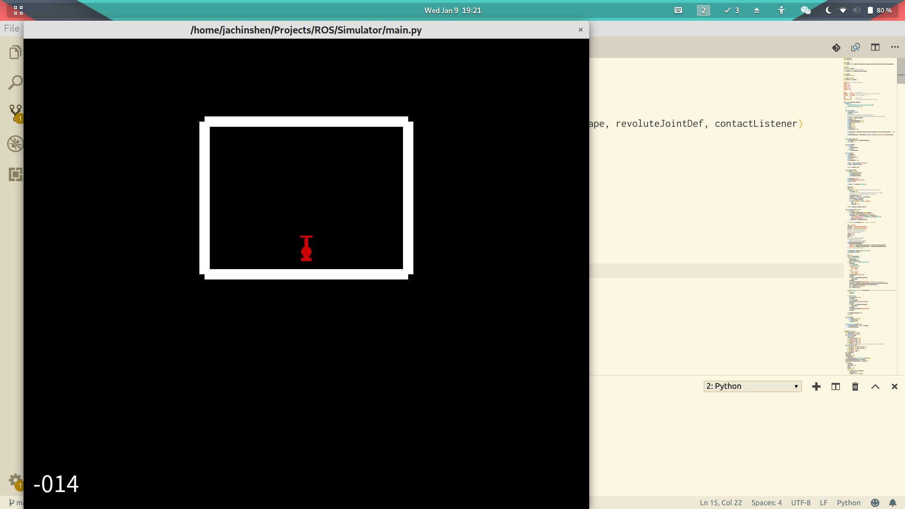
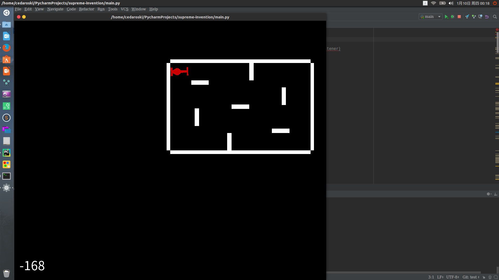

# ICRA 2019 Simulator

## Requirements

- Python3
- OpenAI gym
- Box2D
- swig

## Installation

```
sudo apt-get install swig # or install from source
pip3 install gym box2d box2d-kengz
```

## Run

```
python3 main.py
```



Modify the map and set the unit to meter



## TODO

1. ICRA Map Construction
2. Bullet Simulation
3. Damage and blood calculation
4. Simple strategy implemention
4. Path planning
4. Moving behaviour with mecanum wheels
